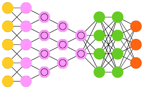

    

# Redes Neuronales.

*Redes Neuronales* es un repositorio que sirve de apoyo a la asignatura de *Redes Neuronales*.

 

## Desarrollador.

* [Ing. Edgard Decena.](mailto:edecena@gmail.com)

## Indice de contenido.

1. **Notebooks:**

    [En progreso]

1. **Guías de Estudio:**
    <table style = "border:hidden;" border = 0>
        <tbody>
            <tr>
                <td><a href="/">Guía 0:</a></td>
                <td>Objetivo General. Objetivos Específicos. Metodología. Contenido Programático.</td>
            </tr>
        </tbody>
    </table>

1. **Bibliofrafía:**
    1. [Introduction to the Math of Neural Network.](libros/Libro_Introduction_to_the_Math_of_Neural_Network.pdf)

## Pre-requisitos.

El curso de *Redes Neuronales* requiere ciertos **requisitos técnicos y cognoscitivos**:

1. **Requisitos técnicos:**
    1. Calculadora científica básica.
    1. Cuenta y repositorio en *GitHub*.

1. **Requisitos cognoscitivos:**
    1. [Tutorial Git.](https://github.com/ejdecena/tutorial_git)
    1. [Tutorial Python.](https://github.com/ejdecena/tutorial_python)
    1. [Tutorial Jupyter.](https://github.com/ejdecena/tutorial_jupyter)
    1. [Herramientas Python (NumPy, Matplotlib y SciPy).](https://github.com/ejdecena/herramientas_python)

## Contribuciones.

Este repositorio es de *código abierto*; lo que significa que cualquier persona interesada puede contribuir en él. Todas las contribuciones serán bienvenidas, incluyendo:

* Correcciones ortográficas.
* Nuevas figuras.
* Correcciones en el código *Python*, incluídas mejoras de estilo.
* Mejores ejemplos.
* Mejores explicaciones. 
* Correcciones de errores conceptuales.

La forma de contribuir es vía la interfaz web de *GitHub*, mediante peticiones de [*Pull requests*](https://github.com/ejdecena/redes_neuronales/pulls), o reportando los problemas/bugs del repositorio por [*Issues*](https://github.com/ejdecena/redes_neuronales/issues).